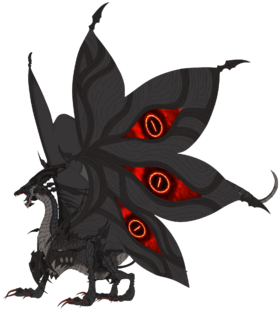

# project1
Demo
https://t4sneem-shah66.github.io/project1/
<!DOCTYPE html>
<html lang="en">
<head>
    <meta charset="UTF-8">
    <meta http-equiv="X-UA-Compatible" content="IE=edge">
    <meta name="viewport" content="width=device-width, initial-scale=1.0">
    <title>Home</title>
    <link rel="stylesheet" href="style.css">
    <link rel="icon" type="icon/x-image" href="./Zekrom.jpg">
</head>
<body>
        <!-- ================= NAVBAR ================= -->

        <nav>
            

                <a href="#">
                    <h4 class="h4">Quick</h4>
                </a>
                <ul class="nav_menu">
                    <li><a href="#">Home </a></li>
                    <li><a href="#">About </a></li>
                    <li><a href="#">Courses </a></li>
                    <li><a href="#">Contact </a></li>
                </ul>
            

        </nav>

        

            

              <section>
                <h1>Lorem, ipsum dolor.</h1>  
              </section>

                 
Lorem ipsum, dolor sit amet consectetur adipisicing elit. In, ut beatae nihil voluptatibus 
                     repellendus accusantium? Lorem ipsum dolor sit amet consectetur adipisicing elit. Nemo est aspernatur rem cupiditate? Dolore, fuga.
                 

              

                <button><a href="#">Read More</a></button>
              

            

            

                
            

        

        <footer>
            

                
No. 6, Jalan Industri Tangkas, Taman Tangkas Kampung Sekolah, 14000 Bukit Mertajam, Pulau
                    Pinang | 

                
+6011 234 5678 | Monday to Saturday: 10.00am - 12.00am

            

        </footer>
</body>
</html>

